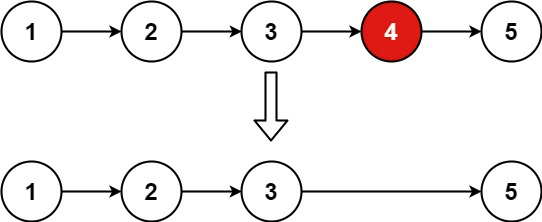
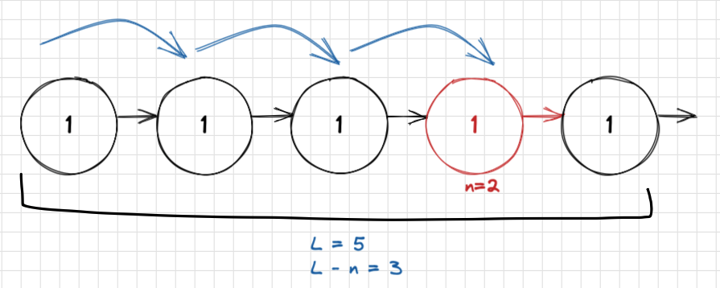
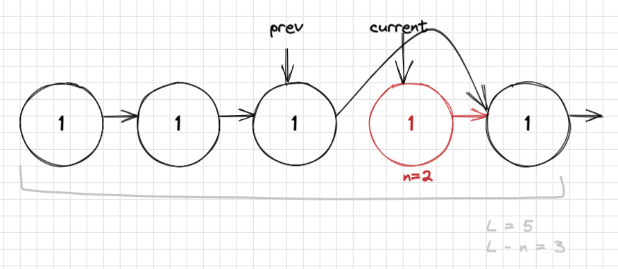

# 19 - Remove Nth Node From List

Difficulty: medium
Done: Yes
Last edited: March 3, 2022 4:53 PM
Link: https://leetcode.com/problems/remove-nth-node-from-end-of-list/solution/
Topic: linked list, two pointers

## Problem

---

Given the `head` of a linked list, remove the `nth` node from the end of the list and return its head.

```
Input: head = [1,2,3,4,5], n = 2
Output: [1,2,3,5]
```



## Solution

---

From intuition the first process that comes to mind is traversing the list to figure out the length `L`. Once we have length we can get the difference between `n` and length, which should signify the node position to remove. Then we can traverse the list a second time and remove the node after  $`L-n`$ steps in the traversal.



Furthermore we will need define a counter after 1st traversal for finding length, and two pointers to keep track of *current* and *previous* once we perform 2nd traversal for removal of `L-n` node. Once we’re at `L-n` steps and remove the node, we can simply break and return head

## Whiteboard

---

Find length and incrementing counter L. 

```python
l = 0
while current is not none: 
	current = current.next
	l += 1
```

once current is at L-n we move pointers, then we can break and return head

```python
while current is not None:
	if counter == L-n:
		previous.next = current.next
		return head
```



## Code

---

```python
# Definition for singly-linked list.
# class ListNode:
#     def __init__(self, val=0, next=None):
#         self.val = val
#         self.next = next
class Solution:
    def removeNthFromEnd(self, head: Optional[ListNode], n: int) -> Optional[ListNode]:
        
        l = 0
        current = head 
        
        while current is not None:
            current = current.next
            l += 1
            
        current = head
        previous = ListNode(-1)
        counter = 0
        
        if l == n:
            # edge case where we only have 1 list node
            previous.next = current.next
            return previous.next
        
        while current is not None:
            if counter == l-n:
                # once we reach nth from end
                previous.next = current.next
                current = previous.next
                return head
            
            else:
                #keep traversing
                previous = current
                current = current.next
            
            counter += 1
            

        
        return previous.next
```

## Time Complexity

---

Having traversed the list the first time to find `L` will take linear time O(n), and the second traversal to remove the `L-n` would also take linear time. Resulting in $O(n) + O(n) = O(2n)$, which can be asymptotically equivalent to  $O(n)$ runtime.