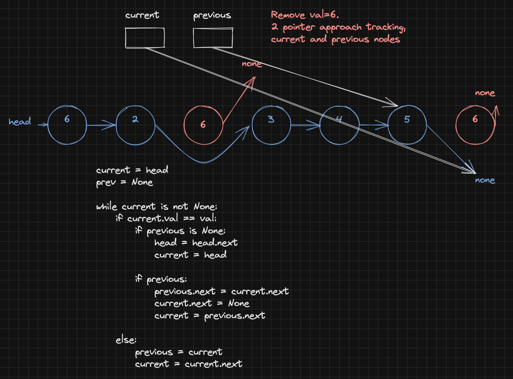

# Remove Linked List Elements

Difficulty: easy
Done: Yes
Last edited: February 27, 2022 1:25 AM
Link: https://leetcode.com/problems/remove-linked-list-elements/
Topic: linked list

## Problem

Given the `head` of a linked list and an integer `val`, remove all the nodes of the linked list that has `Node.val == val`, and return *the new head*.

```
Input: head = [1,2,6,3,4,5,6], val = 6
Output: [1,2,3,4,5]
```

## Solution

Similar to linked list reversal using two pointer iterative approach. Whenever the current node in traversals value is equivalent to our target, we point the `previous` node to the `current.next` node. Else, we will continue our traversal. Hereby shifting the previous pointer and current pointer iteratively.

There’s a caveat, however, whenever the first node of our list is our target —or repeated. Because previous remains undefined. Therefore we need to check if previous is defined beforehand.

## Whiteboard



With target value equal to 6


Problem becomes trickier when target exist as first (or consecutively) node(s)

## Code

```python
# Definition for singly-linked list.
# class ListNode:
#     def __init__(self, val=0, next=None):
#         self.val = val
#         self.next = next
class Solution:
    def removeElements(self, head: Optional[ListNode], val: int) -> Optional[ListNode]:
        
        # for empty list
        if head is None:
            return None
        
        current = head
        previous = None
            
        while current is not None:
                            
            if current.val == val: 
                
                if previous is None:
                    # this will happen when target exist at first node 
                    # or consectuive first (n) nodes
                    head = head.next
                    current = head
                
                if previous: 
                    previous.next = current.next
                    current.next = None
                    current = previous.next
                
            # else keep traversing
            else: 
                previous = current
                current = current.next
                
            
        return head
```