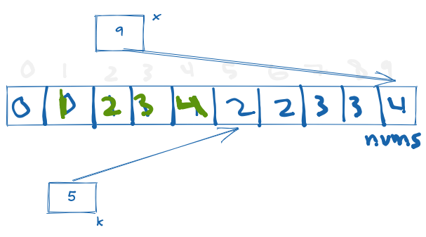

# 26 - remove duplicates from sorted array

Difficulty: easy
Done: Yes
Last edited: February 15, 2022 5:53 PM
Link: https://leetcode.com/problems/remove-duplicates-from-sorted-array/
Topic: two pointers

## Problem

Given an integer array `nums` sorted in **non-decreasing order**, remove the duplicates **[in-place](https://en.wikipedia.org/wiki/In-place_algorithm)** such that each unique element appears only **once**. The **relative order** of the elements should be kept the **same**

## Solution

Similar to #83 but removing duplicates in place requires no additional memory space. We can use a two pointer approach, one pointer to traverse the array and another pointer to traverse the array without duplicates.

## Whiteboard



## Code

```python
class Solution:
    def removeDuplicates(self, nums: List[int]) -> int:
        
        k = 1
        
        for x in range(1, len(nums)): 
            if nums[x] != nums[x-1]:
                nums[k] = nums[x]
                k += 1

        return k if len(nums) != 0 else  0
```