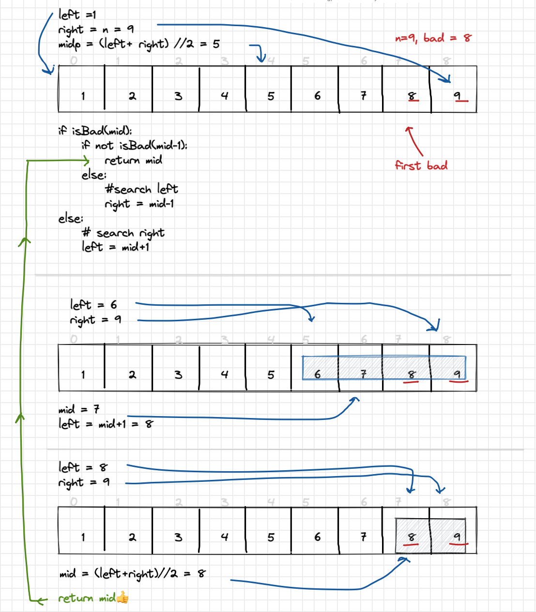

# 278 - first bad version

Difficulty: easy
Done: Yes
Last edited: February 15, 2022 5:28 PM
Topic: binary search

# Problem

You are a product manager and currently leading a team to develop a new product. Unfortunately, the latest version of your product fails the quality check. Since each version is developed based on the previous version, all the versions after a bad version are also bad.

Suppose you have `n` versions `[1, 2, ..., n]` and you want to find out the first bad one, which causes all the following ones to be bad.

You are given an API `bool isBadVersion(version)` which returns whether `version` is bad. Implement a function to find the first bad version. You should minimize the number of calls to the API.

# Solution

Perform an iterative binary search, don’t need to allocate space for array

pseudo

```python
define left_ptr, right_ptr

while left <= right:
	define mid = (left+right)//2

	if mid is bad: 
		if mid-1 is not bad:
			mid is first_bad; return
		else: 
			search left
	else:
		search right
			

return n

```

# Whiteboard



# Code

```python
# The isBadVersion API is already defined for you.
# def isBadVersion(version: int) -> bool:

class Solution:
    def firstBadVersion(self, n: int) -> int:
        left, right = 1, n
        
        while left <= right:            
            mid = (left+right) // 2
            
            if isBadVersion(mid):
                if not isBadVersion(mid-1):
                    # if middle is first bad
                    return mid
                else:
                    # search left
                    right = mid-1
            else: 
                #search right
                left = mid+1
                
        return n
```

## Time Complexity

Having N elements with Binary search algorithm takes O(logN)