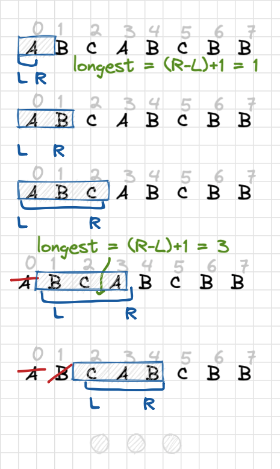
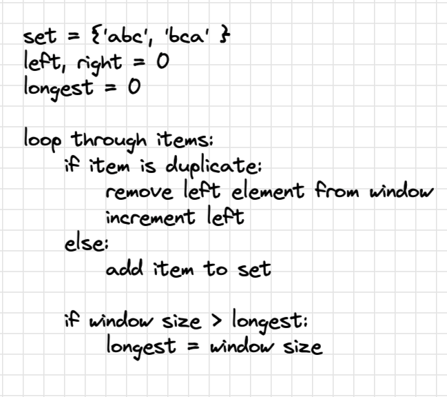

# 3 - Longest Substring Without Repeating Characters

Difficulty: medium
Done: Yes
Last edited: February 18, 2022 2:06 PM
Link: https://leetcode.com/problems/longest-substring-without-repeating-characters/
Topic: set, sliding window

## Problem

Given a string `s`, find the length of the **longest substring** without repeating characters.

Example 1:

```
Input: s = "abcabcbb"
Output: 3
Explanation: The answer is "abc", with the length of 3.

```

Example 2

```
Input: s = "bbbbb"
Output: 1
Explanation: The answer is "b", with the length of 1.

```

Example 3

```
Input: s = "pwwkew"
Output: 3
Explanation: The answer is "wke", with the length of 3.
Notice that the answer must be a substring, "pwke" is a subsequence and not a substring.

```

Constraints

- `0 <= s.length <= 5 * 104`
- `s` consists of English letters, digits, symbols and spaces.

## Solution

Intuitively I was attempting to use a hashtable, and buffer variable. Looping through array and adding current element to buffer, stoping when we reach a duplicate insider our buffer, then copying the buffer into our hashtable. However, it became complicated as far as string manipulation. 

A better approach is to use a **sliding window** algorithm with two pointers, and a set which allows for unique elements. Found algorithm to be very similar to my initial approach, with the exception that using sliding window we easily remove the left-most duplicate element in the current window. 

Then the size of the window at the largest point can be used to return to the largest substring, through each iteration we compare the current size of the set to the *longest* variable and overwrite if necessary

```python
if len(charset) > longest:
longest = len(charset)
```

## Whiteboard





## Code

```python
buffer = []
        subs = []
        
        if len(s)  == 1:
            return 1
        elif len(s) == 0:
            return 0

        for i in range(len(s)):
            if s[i] not in buffer:
                buffer.append(s[i])
            else: 
                subs.append(''.join(buffer))
                buffer.clear()
                buffer.append(s[i])

        subs.append(''.join(buffer))
        
        return len(max(subs, key=len))
```

```python
class Solution:
    def lengthOfLongestSubstring(self, s: str) -> int:
       # sliding window approach requiring two pointers
        # use set to hold current window values
        left = 0
        right = 0
        longest = 0
        charset = set()

        for right in range(len(s)):
            while s[right] in charset:
                charset.remove(s[left])
                left += 1
            
            charset.add(s[right])
            
            if len(charset) > longest:
                # current set is larger than longest, overwrite
                # eventually longest will be hold size of largest charset
                longest = len(charset)
        
        return longest
```
