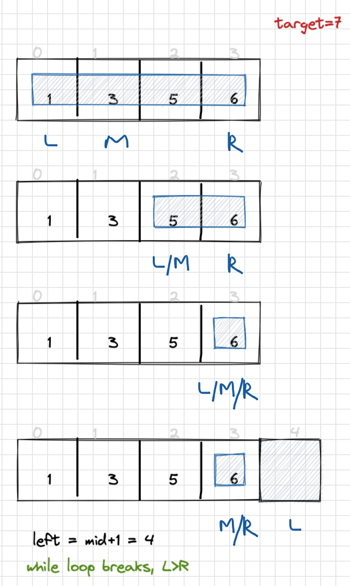
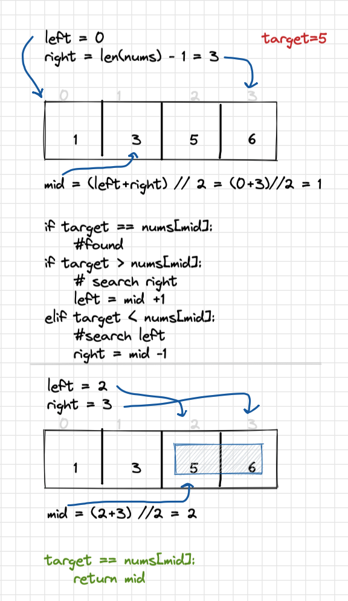

# 35 - Search Insert Position

Difficulty: easy
Done: Yes
Last edited: February 16, 2022 5:09 PM
Link: https://leetcode.com/problems/search-insert-position/
Topic: array, binary search

## Problem

Given a sorted array of distinct integers and a target value, return the index if the target is found. If not, return the index where it would be if it were inserted in order.

You must write an algorithm with `O(log n)` runtime complexity.

## Solution

Straight away we can say this will require a **binary search** approach to accomplish a runtime complexity of $O(log*n)$. Three pointer approach to keep track of left, right, and midpoint elements of sorted array.

We want to return index of target, which will be tracked by midpoint value. Only constraint is if target is not in array, then we want to return the index of where it would be inserted

## Whiteboard



solution if target in array



target = 7, not in array, return left ptr

## Code

```python
class Solution:
    def searchInsert(self, nums: List[int], target: int) -> int:
        
        left, right = 0, len(nums)-1
        
        while left <= right: 
            mid = (left+right) // 2
            if target == nums[mid]:
                return mid
            elif target > nums[mid]:
                # search right
                left = mid + 1
            elif target < nums[mid]:
                # search left
                right = mid - 1
                
        return left
```