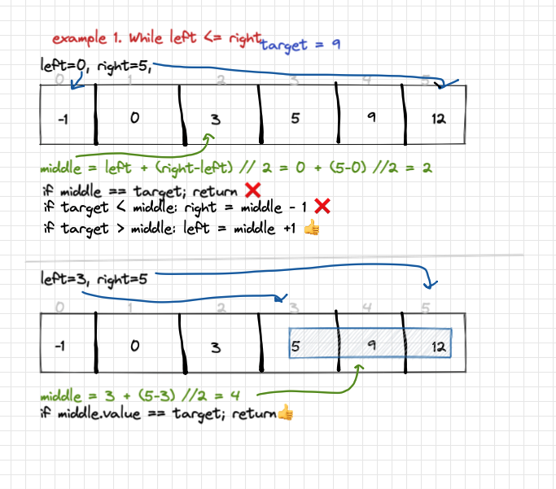

# 704. Binary Search

Difficulty: easy
Done: Yes
Last edited: February 12, 2022 5:53 PM
Link: https://leetcode.com/problems/binary-search/
Topic: binary search

# Problem

Given an array of integers `nums` which is sorted in ascending order, and an integer `target`, write a function to search `target` in `nums`. If `target` exists, then return its index. Otherwise, return `-1`.

# Solution

goal of the algorithm is to divide array in half, if our `target` is smaller than current then we take the left side of the array, if `target` is larger than the *current* then we take the right side of the array. Repeat

# Whiteboard



target = 9


target = 2 (not existing)

# Code

```python
class Solution:
    def search(self, nums: List[int], target: int) -> int:
        
        try:
            i = nums.index(target)
        except:
            i = -1
            
        return i
```

```python
class Solution:
    def search(self, nums: List[int], target: int) -> int:
        # iteratively
        
        left = 0
        right = len(nums) - 1
        while left <= right:
            middle = left + (right-left) // 2
            
            if nums[middle] == target: 
                return middle
            
            if target < nums[middle]: 
                # use left side
                right = middle - 1
            
            if target > nums[middle]:
                # use right side
                left = middle + 1
                
        return -1
							
```
